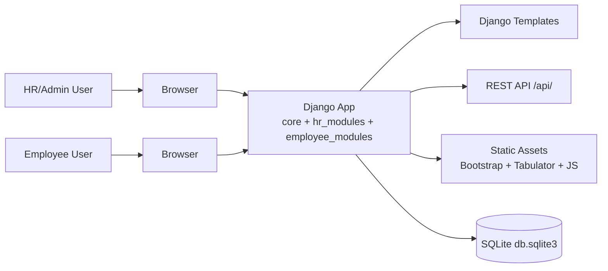
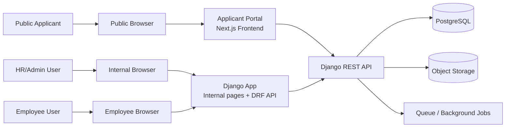

# System Overview

This document captures the current technical stack, the current and target architecture, and the documentation/implementation requirements for the `r_hcm` platform.

## Scope

The platform currently includes:
- internal HR/admin workflows
- employee self-service workflows
- REST APIs for the current modules

The target platform also includes:
- a public applicant portal module

## Tech Stack

### Current stack

| Layer | Current choice | Notes |
| --- | --- | --- |
| Backend language | Python | Main application language |
| Backend framework | Django 5.2.8 | Server-rendered pages, auth, admin, ORM |
| API layer | Django REST Framework 3.16.1 | CRUD APIs under `/api/` |
| Database | SQLite locally | Current local default in `settings.py` |
| Internal frontend | Django templates + plain JavaScript | Shared helpers and Tabulator-based CRUD pages |
| Table/grid layer | Tabulator | Shared row editing and search patterns |
| Styling | Bootstrap-based static assets + custom CSS | Existing admin-style UI |
| Auth | Django session auth | Current HTML and API flow |
| Local containerization | Docker Compose | Added for team onboarding |

### Recommended target stack

| Layer | Recommended choice | Why |
| --- | --- | --- |
| Backend | Django + DRF | Keep business rules, auth, admin, and APIs in one backend |
| Shared database | PostgreSQL | Better fit for team development and future public module |
| Internal portal frontend | Keep Django templates for now | Lower rewrite risk for current HR/admin workflows |
| Public applicant portal frontend | Next.js + TypeScript | Better fit for public-facing routes, richer UX, and future growth |
| File storage | Object storage for uploaded applicant files | Better than storing large files inside the app container |
| Async/background work | Celery + Redis or equivalent queue | For email, notifications, and long-running tasks |
| Local orchestration | Docker Compose | Consistent developer setup |

## Current Architecture



## Target Architecture



## Architectural Direction

### Keep in Django

- HR/admin pages
- employee-facing internal workflows already implemented
- business rules
- approval workflow logic
- leave balance calculations
- user/session authentication
- admin/back-office data maintenance

### Move or add as separate frontend

- public applicant landing pages
- job listing pages
- applicant registration and login UI
- applicant profile and application submission UX
- applicant status tracking dashboard

## Implementation Requirements

### Functional requirements

| Requirement | Status |
| --- | --- |
| HR/admin users can manage employees, divisions, positions, time rules, salary grades, plantilla, leave types, leave credits, leave applications, and approvers | Current |
| Employee users can access employee-facing leave workflows | Current |
| API endpoints are available for internal CRUD flows | Current |
| Public applicant users can browse jobs and submit applications | Planned |
| Public applicant users can create accounts and track application status | Planned |
| Applicant portal integrates with the same Django backend and shared business data | Planned |

### Non-functional requirements

| Requirement | Status |
| --- | --- |
| Environment-specific configuration must come from env files or container env vars | Current direction |
| Secrets must not be committed to Git | Required |
| Team setup should work through both local Python venv and Docker Compose | Current |
| Shared environments should use PostgreSQL instead of SQLite | Recommended |
| API contract must be documented and kept current | Current |
| Public-facing module should be responsive and production-ready | Planned |
| Role-based access rules must remain enforced in backend code, not frontend only | Required |
| Automated backend tests must run in CI | Current direction |
| File upload handling for applicant documents should use durable storage | Planned |

## Documentation Requirements

The minimum documentation set for this project should include:

| Document | Purpose | Status |
| --- | --- | --- |
| `README.md` | onboarding, local setup, Docker setup, common commands | Present |
| `API_CONTRACT.md` | current REST API contract | Present |
| `docs/SYSTEM_OVERVIEW.md` | tech stack, architecture, requirements | Present |
| `docs/RECRUITMENT_CENTRAL_DATA.md` | recruitment requirements, approval workflow, and implementation plan | Present |
| environment variable reference | document `.env` and Docker env settings | Present in `README.md` |
| deployment runbook | production deployment, migrations, backups, rollback | Pending |
| applicant portal module spec | scope, routes, auth flow, UX boundaries | Pending |
| test strategy | unit, integration, and end-to-end test expectations | Pending |

## Suggested Repo Documentation Structure

```text
README.md
API_CONTRACT.md
docs/
  SYSTEM_OVERVIEW.md
  RECRUITMENT_CENTRAL_DATA.md
  DEPLOYMENT_RUNBOOK.md
  APPLICANT_PORTAL_SPEC.md
  TEST_STRATEGY.md
```

## Next Documentation Deliverables

Recommended next docs to add:

1. `docs/APPLICANT_PORTAL_SPEC.md`
2. `docs/DEPLOYMENT_RUNBOOK.md`
3. `docs/TEST_STRATEGY.md`

## Related Files

- `README.md`
- `API_CONTRACT.md`
- `docs/RECRUITMENT_CENTRAL_DATA.md`
- `context.md`
- `compose.yaml`
- `Dockerfile`
